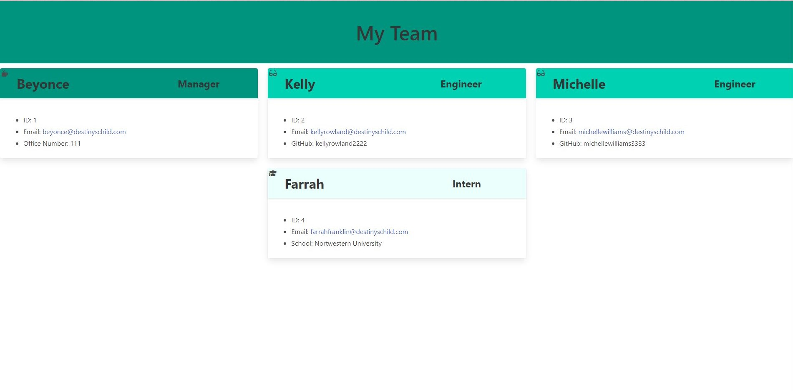

# Team Profile Generator


This is a command line application that uses node.js to create a team roster with HTML. 

My motivation when creating this project was to further challenge my understanding of node and its packages, and to fully generate a clean and professional HTML page using only the command line, node.js and javascript.

## Table of Contents
-[Installation](#installation)

-[Usage](#usage)

-[Demo](#demo)

-[Tests](#tests)

-[Questions](#questions)

-[License](#license)

## Installation
To install this package please make sure you have node.js installed and run the following command in your command line: 

```md
npm install package.json
```

## Usage 
To use this application, open your command line and navigate to the appropriate directory and then run the following command:

```md
node index.js
```
Once the program is started, follow the prompts and answer all the questions provided. Once finished, the application will create a new HTML file in the `/dist` folder. 

## Demo


Below you will see an example of how the generated HTML file will appear:



## Tests 
Tests are run using [Jest](https://jestjs.io/). To initiate the tests, please run the following command in your command line: 

```md
npm run tests
```

Below is a short demonstration of how to run the tests: 


## Questions 
For more information and to see more of my work, please visit my [GitHub](https://github.com/maiavelli/).

For any additional questions or general inquiries, you can contact me at maiacamilledavis@gmail.com.

## License
Copyright (c) `2022`, `Maia Davis`

Permission to use, copy, modify, and/or distribute this software for any purpose with or without fee is hereby granted, provided that the above copyright notice and this permission notice appear in all copies.

THE SOFTWARE IS PROVIDED "AS IS" AND THE AUTHOR DISCLAIMS ALL WARRANTIES WITH REGARD TO THIS SOFTWARE INCLUDING ALL IMPLIED WARRANTIES OF MERCHANTABILITY AND FITNESS. IN NO EVENT SHALL THE AUTHOR BE LIABLE FOR ANY SPECIAL, DIRECT, INDIRECT, OR CONSEQUENTIAL DAMAGES OR ANY DAMAGES WHATSOEVER RESULTING FROM LOSS OF USE, DATA OR PROFITS, WHETHER IN AN ACTION OF CONTRACT, NEGLIGENCE OR OTHER TORTIOUS ACTION, ARISING OUT OF OR IN CONNECTION WITH THE USE OR PERFORMANCE OF THIS SOFTWARE.
